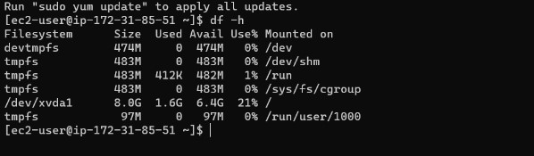
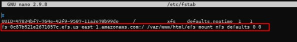
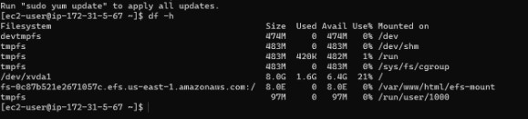


IMPLANTACIÓN DE APLICACIONES WEB
# PRÁCTICA 4.3 Instalación EFS y su arquitectura 

# Índice
-----
[**PRÁCTICA 4.3 Instalación EFS y su arquitectura**](#_t407xxhvh3jg)	

[**Índice**](#_9fb30wxk007a)	

[Infraestructura](#_9mvtu6bnssmr)	

[- Configuración de la instancia:](#_76psupelrj5e)	

[- Configuración de la red:](#_mhuc7v9353ou)	

[- Reglas de entrada securizadas:](#_1qwlil5061nh)	

[Software](#_hw2wvrcvtlg7)	

[Comprobación de la Sitio Web](#_vy27d3uf17no)	

[Comprobación Sitio Web 2](#_lim3kl7jkgo9)	

[Implementación Balancer-Manager](#_9xmg9waprjbv)	

[Comprobación Servidor Proxy](#_oezzapyew1uv)	

[Comprobación del balanceador de cargas](#_og9s0izfmkty)	

[Webgrafía](#_c3aq1klkog0a)	
##
Implantación EFS y arquitectura

Para esta práctica haremos la siguiente arquitectura de 2 niveles;

Fase 1. Servidor Proxy (balanceador de cargas) 

Fase 2. Servidores Web Linux (x2) y Servidor EFS

### **Infraestructura** 

Para las instancias EC2 dispondremos de las siguiente configuración de la instancia, configuración de red, reglas de entrada :
- #### Configuración de la instancia:

    1. Amazon Linux 2 AMI (Capa Gratuita)

    2. t2.micro 1 vCPU

    3. RAM: 1Gb. 

- #### Configuración de la red:

    Permite el tráfico de los puertos 22 (SSH) y 80 (HTTP), el puerto 443 no se utilizará en dicha práctica.

- #### Reglas de entrada securizadas:

**EC2 con servidor Web**

Para el servidor Web, añadiremos la regla de entrada de HTTP con acceso solo de la IP privada de nuestro servidor proxy.

**Servidor EFS de AWS**

Con dicha regla sólo permite que accedan las EC2 con el grupo de seguridad de los Servidores Web.

**EC2 con servidor proxy**

En dicho servidor, primero activaremos el puerto 22 para hacer las configuraciones necesarias y posteriormente se eliminará la regla del puerto 22.

**Creación de un sistema de archivos (EFS)**

Se seleccionará la clase de almacenamiento estándar ya que vamos a utilizar instancias con zonas de disponibilidad distintas, por lo que para esta práctica y para empresas que tienen sedes en distintas ciudades es conveniente utilizar esta opción.

### **Software**

**Configuración Servidores Web Linux**

Instalamos la máquina de Linux directamente con dicho el siguiente script, para que una vez iniciada ya estén las siguientes opciones descargadas.

Una vez iniciada la instancia Linux, comprobamos que se ha ejecutado el script correctamente, verificando el estado de httpd mediante systemctl.

Tras la verificación, crearemos un directorio donde montaremos un punto de anclaje a dicho directorio y descargamos la web de Netflix mediante el comando wget.

Tras la creación del directorio y el punto de anclaje a dicho directorio, verificamos que el punto de anclaje se ha creado correctamente con el siguiente comando.

Seguidamente descargamos el archivo zip de Netflix, y lo descomprimimos.

### **Comprobación de la Sitio Web**

Efectivamente, una vez buscada la web mediante la ruta de nuestra IP pública del servidor web y la carpeta donde tenemos los archivos correspondiente a la web, nos entrada en la página web que hemos subido. 

Como no queremos poner toda la ruta de (IP/efs-mount/index.html), configuramos la siguiente carpeta en Linux, que es la equivalente a /etc/apache2/sites-enabled/000-default en Ubuntu, para que al poner directamente la ip pública de nuestro servidor acceda a la web de Netflix.

### **Comprobación Sitio Web 2**

Para esta comprobación solo buscaremos por la dirección IP pública de nuestro sitio web, ya que hemos modificado el archivo de httpd y hemos reseteado el servicio.

### **Implementación Balancer-Manager** 

Para la implementación del balancer-manager haremos los mismos pasos que en la práctica anterior V1, con la siguiente configuración.

Tras finalizar la configuración, reseteamos el servicio de apache y comprobamos que funciona correctamente el balanceo de cargas con la IP pública de nuestro servidor proxy.

### **Comprobación Servidor Proxy**

Tras su comprobación veremos si el balanceo de cargas se está ejecutando correctamente.

### **Comprobación del balanceador de cargas**

### **Cosas a tener en cuenta**
Cuando apagamos las máquinas, el mount que teníamos creado se eliminará automáticamente y ya no tendremos el mount creado en los pasos anterior si lo miramos en el df -h

Para automatizarlo y que se conecte directamente, debemos irnos al fichero y /etc/fstab y añadir una nueva línea.

Reiniciamos la instancia y comprobamos que al reiniciarla, se añade directamente el mount que hemos añadido en el archivo anterior.

### **Webgrafía**

<https://github.com/PedroMSanchezz/AWS_Practicas.git>

