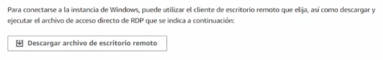

IMPLANTACIÓN DE APLICACIONES WEB
# PRÁCTICA 4.4 MultiAZ con una instancia en espera

# Índice
-----
[**PRÁCTICA 4.4 ](#_t407xxhvh3jg)[MultiAZ](#_t407xxhvh3jg)[ con una instancia en espera](#_t407xxhvh3jg)	**1****

[**Índice](#_9fb30wxk007a)	**2****

[Creación BD con ](#_gcg03yc1g5l4)[multiAZ](#_gcg03yc1g5l4)	3

[Creación Windows en Nube](#_ja4buvzvyrk)	6

[Modificaciones de las reglas de entrada](#_yz4kyry4caea)	8

[Conexión RDP de Windows](#_13l7t5rlul8i)	9

[Configuración cliente Windows](#_tlrw5nvffzqr)	12
##
## Creación BD con multiAZ

Tras iniciar nuestro laboratorio, crearemos una base de datos para la realización de MultiAZ con una instancia en espera.

Escogeremos la opción de *Creación estándar*, ya que con está opción tenemos menos limitaciones que si escogemos la creación sencilla, con dicha creación nos permite definir todas las opciones, incluidas las de disponibilidad, seguridad, copias de seguridad y mantenimiento.

Seguimos bajando y encontraremos el apartado de **Plantillas**, en dicho apartado escogemos la opción de producción, ya que nos permite mayor disponibilidad (para utilizar el multiAZ) y un rendimientos rápido.

En la siguiente opción encontraremos el apartados de **Disponibilidad y durabilidad**, escogemos la 2ª opción “Instancia de base de datos Multi-AZ”, que es la que utilizaremos en esta práctica ya que nos crea un BD y una instancia de BD en espera en una zona de disponibilidad diferente.

En el apartado de configuración rellenamos los datos como queremos que se llame nuestra BD y le introducimos una contraseña para iniciar dicha BD.

En el siguiente apartado nos encontramos con la **Configuración de la instancia,** escogeremos la tercera opción ya que utilizara la t3.micro.

Seguimos bajando y nos encontramos el espacio de almacenamiento, como en nuestro caso queremos gastar poco, estableceremos los mínimos disponibles para su creación.

` `

En el siguiente apartado **Conectividad**, dejamos las opciones por defecto, ya que lo conectaremos manualmente más adelante.

Le agregamos el Acceso público para que nuestra RDS le asigne una IP pública a la base de datos.

En el siguiente apartado nos encontramos con el grupo de seguridad, para dicho grupo tendremos que haber creado un grupo de seguridad para MYSQL.

Dicho grupo, se modificará el acceso a los datos.

Tras la finalización de todos los apartados anteriores, lanzamos la base de datos y se empezará a crear.

## Creación Windows en Nube
Nos vamos a las instancias de EC2, y lanzaremos una nueva instancia, para este caso utilizaremos una EC2 de Windows.

El tipo de instancia será una t2.micro igual que las instancias de EC2 Linux, que hemos creado en prácticas anteriores.

El par de clave, agregamos bien la vockey o un .pem creadas en instancias anteriores, en mi caso he agregado un .pem de la instancia de Linux1 de la práctica 4.3.

Bajamos hasta el apartado de grupos de seguridad y seleccionamos el SGWeb creado en la práctica anterior.

Tras finalizar estos pasos, terminamos su instalación lanzando la instancia.

## Modificaciones de las reglas de entrada
**Grupo de seguridad Web**

Nota: Para securizar, basta con eliminar la regla del puerto 22 (SSH)

**Grupo de seguridad MySQL**

Para este grupo de seguridad, solo le permitimos el acceso a los que puedan acceder al SGWEb.

## Conexión RDP de Windows

Nos conectaremos a nuestra EC2 Windows, que hemos creado anteriormente, y nos iremos al apartado de Cliente de RDP (ya que también lo hemos añadido en la regla de entrada del grupo de seguridad del apartado anterior).

Cuando estemos en el apartado del cliente RDP, haremos click en *Obtener contraseña*.

En nuestro caso, al utilizar el par de claves .pem, que habíamos utilizado en la creación de nuestra RDS cargamos el archivo de ese .pem utilizado.

Una vez descargada nuestra clave privada, nos vamos al apartado anterior y nos aparecerá la contraseña para iniciar sesión en nuestro cliente Windows.

Para poder acceder a nuestro cliente de Windows, descargamos el cliente windows clicando en Descargar archivo de escritorio remoto, situado un poco arriba de la contraseña.

Una vez finalizado, movemos el icono a nuestro escritorio y lo iniciamos.

En dicha credencial, agregamos la contraseña que nos han dado en el apartado anterior.

## Configuración cliente Windows

Una vez iniciado el cliente Windows, navegamos por internet y descargamos la aplicación de HeidiSQL.

Una vez descargado iremos a nuestra RDS creada y copiamos el punto de enlace.

Volvemos al cliente Windows, y añadimos nuestra BD en HeidiSQL, con el punto de enlace copiado y las credenciales de la BD.

Una vez introducidos los datos, ya estaremos dentro de nuestra BD y podremos crear nuestra base de datos y sus correspondientes tablas.

